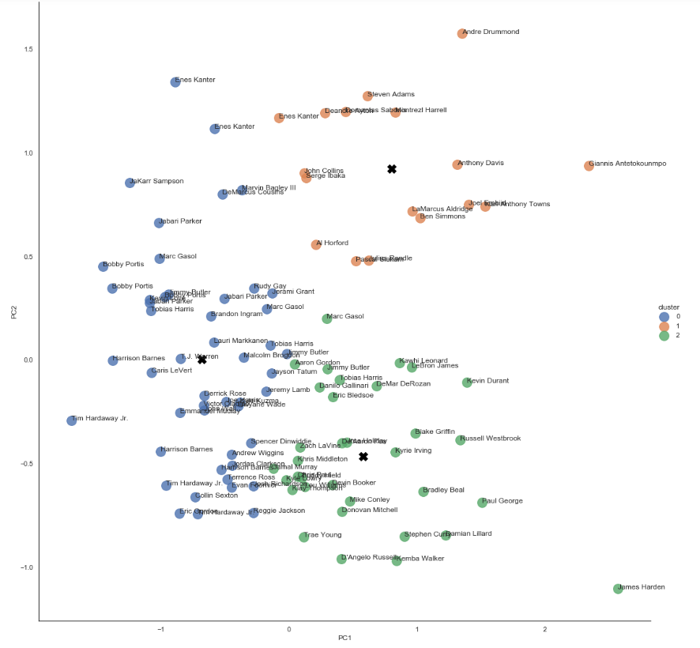
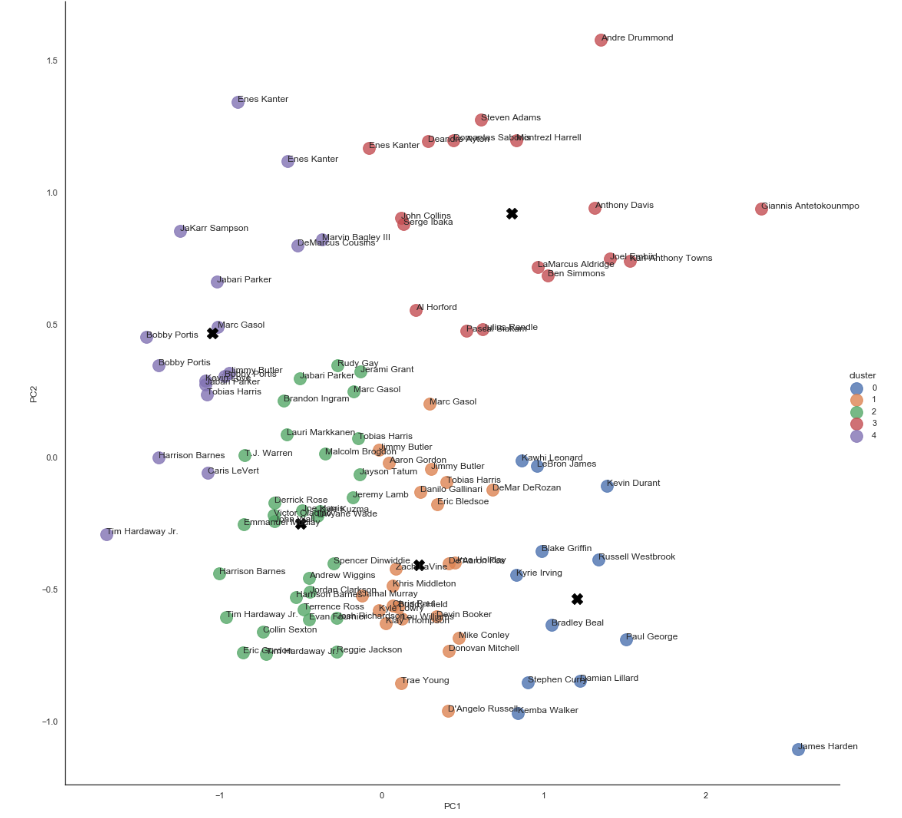

# NBA Clustering based on Similar Skillset
## Background
- NBA players were grouped together based on their stats provided from: [Basketball Reference](https://www.basketball-reference.com/leagues/NBA_2020_per_game.html) 

## Code and Resources Used
- Python Version 3.8
- Jupyter Notebook, Spyder
- [Basketball Reference](https://www.basketball-reference.com/leagues/NBA_2020_per_game.html) 

## Files
- [NBA_cluster.ipynb](https://github.com/jason-huynh83/NBA-cluster/blob/master/NBA_cluster.ipynb) - Jupyter notebook for clustering NBA players based on similar skillset
- [HC_Cluster.ipynb](https://github.com/jason-huynh83/NBA-cluster/blob/master/HC_Cluster.ipynb) - Jupyter notebook for Hierarchical Clustering of NBA players based on similar skillset
- [data_scrape.py](https://github.com/jason-huynh83/NBA-cluster/blob/master/data_scrape.py) - Python script to scrape NBA players stats
- [nba.csv](https://github.com/jason-huynh83/NBA-cluster/blob/master/nba.csv) - csv file for all NBA players stats

## The Dataset 
- Scraping the data from Basketball Reference and manipulating it, the dataset contains:
	- NAME: Player's Name
	- Pos: Player's position
	- MP: Minutes Played
	- PER: Player Efficiency Rating
	- TS%: True Shooting %
	- 3PAr: 3pt Attempt Rate
	- Ftr: Free throw Attempt Rate
	- ORB%: Offensive Rebound %
	- DRB%: Defensive Rebound %
	- TRB%: Total Rebound %
	- AST%: Assist %
	- STL%: Steal %
	- BLK%: Block %
	- TOV%: Turnover %
	- USG%: Usage %
	- OWS: Offensive Win Shares
	- DWS: Defensive Win Share
	- WS: Win Shares
	- WS/48: Win Shares per 48 games
	- OBPM: Offensive Box Plus/Minus
	- DBPM: Defensive Box Plus/Minus
	- BPM: Box Plus/Minus
	- VORP: Value over Replacement Player
	- 2P: 2-Point field goal per game
	- 2P%: 2-Point %
	- 2PA: 2-Point Attempts
	- 3P: 3-Point field goal per game
	- 3P%: 3-Point % 
	- 3PA: 3-Point Attempts per game
	- AST: Assists Per Game
	- BLK: Blocks Per Game
	- DRB: Defense Rebound per game
	- FG: Field goals per game
	- FT: Free throws per game	
	- FT%: Free throw %
	- FTA: Free throw attempts per game
	- ORB: Offensive Rebound per game
	- PF: Personal Fouls
	- PTS: Points per game
	- STL: Steals per game
	- TOV: Turnover per game
	- TRB: Total rebounds per game
	- PPG: Average Points per game
	- Salary: Player salary

## Clusters
- Utilziing the elbow method and silhouette scores, NBA players were grouped into 3 distinct clusters.
- Cluster 0 represents players who are generally more 'bigger' in the league and can grab rebounds
- We can see here, that cluster 1 favours more of the Fowards positions (C and PF)
- While cluster 2 favours the Guards positions (PG and SG)

- In an attempt to cluster each player by their positions (PG, SG, SF, PF, C) I ran the algorithm again for 5 clusters.
- We can see using 5 clusters, we were able to cluster each player respective to their position
- Clusters 3 and 4 represent players who play the Forward position (PF and C)
- Clusters 0 and 1 represent players who play the Guard Position (PG and SG)
- While cluster 2 is an interesting cluster as it clusters players who tend to have a higher shooting rate.
	- It clusters PF's who have a higher shooting percentage, e.g. Lauri Markkanen and Marc Gasol.

